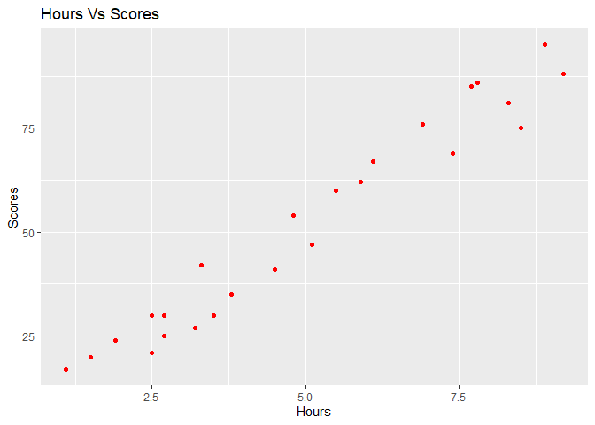
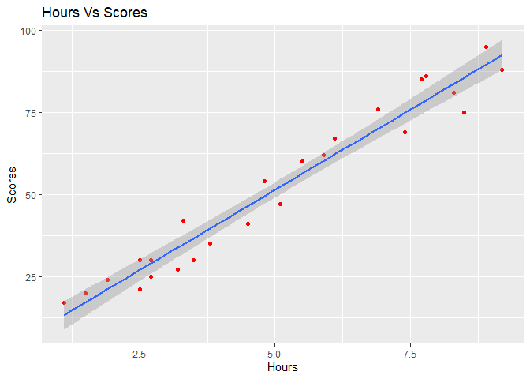

Regression - Supervised Machine Learning
================

# Objective

Objective is to create a model that will predict the Marks of a student
given the number of Hours studied.

# Loading Necessary Library

# Loading Data

``` r
dataset <- read.csv('http://bit.ly/w-data')
```

# Initial Analysis On Dataset

  - First we will look how the data looks

<!-- end list -->

``` r
head(dataset,5)
```

    ##   Hours Scores
    ## 1   2.5     21
    ## 2   5.1     47
    ## 3   3.2     27
    ## 4   8.5     75
    ## 5   3.5     30

  - we will check the number of rows and columns in the dataset

<!-- end list -->

``` r
dim(dataset)
```

    ## [1] 25  2

  - Our Dataset consist of 25 rows with 2 columns.

We want to find how the Number of Hours studied impacts the Scores
obtained by the student. We want to find the linear relation between
Hours and Scores. So we can see that Score is our Dependent Variable and
Scores is our Independent Variable.

# Initial Discriptive Analysis

  - First we will plot Hours Vs Score

<!-- end list -->

``` r
ggplot(dataset,aes(x= Hours,y= Scores)) +
  geom_point(color = "red") +
  ggtitle('Hours Vs Scores')
```

<!-- -->

From the above scattern plot we can clearly see, there is a positive
correlation, and the positive correlation can be found below.

``` r
round(cor(dataset$Hours,dataset$Scores),2)
```

    ## [1] 0.98

  - We can see the correlation between Hour and Scores is *0.98* which
    is highly correlated, but we have to keep in mind *“Correlation does
    not imply causation”*

# Creating a model

  - We will create a simple linear regression Model, to predict the
    Scores given the number of Hours, in our case it is 9.5 Hours.

## Spliting the Dataset

  - Since our dataset consist of only 25 rows, we will create a model
    with entire dataset and we will predict it on the splitted dataset
    for more accuracy.

  - The dataset is splited into two parts, Train and Test Dataset.

<!-- end list -->

``` r
sample <- sample.split(dataset,0.8)
train_dataset <- subset(dataset, sample == TRUE)
test_dataset <- subset(dataset,sample == FALSE)
```

  - we have created Train and Test Dataset, Now we will create our model
    with train dataset

## Building Model

``` r
regression_model <- lm(Scores~.,dataset)
summary(regression_model)
```

    ## 
    ## Call:
    ## lm(formula = Scores ~ ., data = dataset)
    ## 
    ## Residuals:
    ##     Min      1Q  Median      3Q     Max 
    ## -10.578  -5.340   1.839   4.593   7.265 
    ## 
    ## Coefficients:
    ##             Estimate Std. Error t value Pr(>|t|)    
    ## (Intercept)   2.4837     2.5317   0.981    0.337    
    ## Hours         9.7758     0.4529  21.583   <2e-16 ***
    ## ---
    ## Signif. codes:  0 '***' 0.001 '**' 0.01 '*' 0.05 '.' 0.1 ' ' 1
    ## 
    ## Residual standard error: 5.603 on 23 degrees of freedom
    ## Multiple R-squared:  0.9529, Adjusted R-squared:  0.9509 
    ## F-statistic: 465.8 on 1 and 23 DF,  p-value: < 2.2e-16

  - We can see that Hours Variable is Highly significane in predicting
    the Scores, denoted by ’\*\*\*’ and the R-Square value is 0.9446,
    indication that the model can explain 94% of varaince in the
    dataset.

  - Our Simple Linear Equation will be *Score = 6.3512 + 9.1793(Hours)*

## Scatter Plot with regression line.

``` r
ggplot(dataset,aes(x= Hours,y= Scores)) +
  geom_point(color = "red") +
  ggtitle('Hours Vs Scores') +
  geom_smooth(method = 'lm')
```

    ## `geom_smooth()` using formula 'y ~ x'

<!-- -->

## Prediction on test dataset

``` r
test_pred <- predict(regression_model,test_dataset)
```

  - The Scores in test dataset is predicted and stored in test\_pred.

## Model Performance

  - Now we will measure how accuracy our model by MAE, Whynot RMSE ?,
    since RMSE area mostly preffered when there are outliers. In our
    case there were no outliers(From the above scatter plot.). The Lower
    the mae value, more the model performace.

<!-- end list -->

``` r
mae(test_dataset$Scores,test_pred)
```

    ## [1] 4.91476

*MAE = 4.91476*

# Final Prediction

  - Now we have created a model, the last set is to predict marks for
    our given hours that is 9.25 hours

<!-- end list -->

``` r
predict(regression_model,data.frame(Hours = c(9.25)))
```

    ##        1 
    ## 92.90985

So, Our Model has predicted that a student, who studies for 9.25 hours
will get a score of *92.909*, we will round it to 93.
