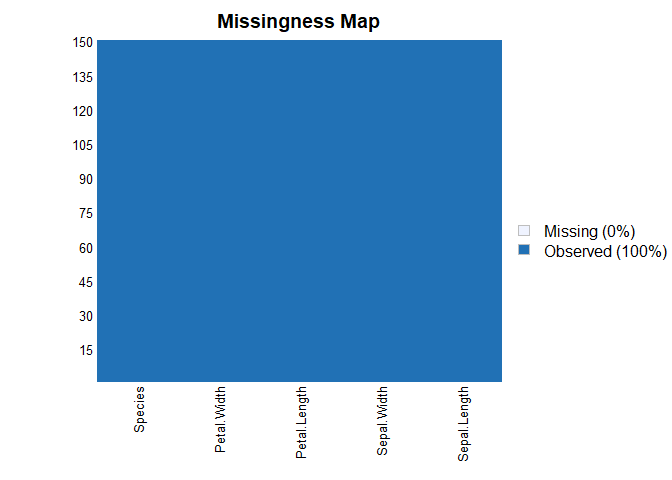
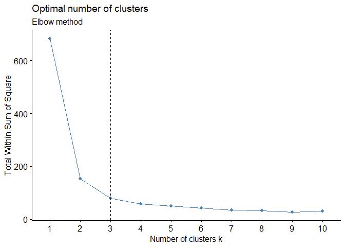
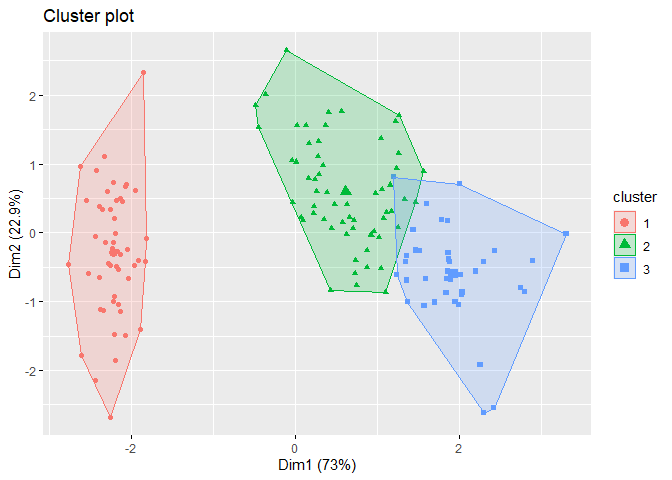

<<<<<<< HEAD
TASK 3 K-Means Cluster
================

# Objective

  - So the objective of cluster or group datas which are similar in
    nature using K-Means cluster Algorithm .This Clustering comes under
    UNsuperwised Machine learning Models.

# Loading Dataset

  - We will be usign *iris* dataset, which is an in build dataset in R
    language. We will have a look at it column names and sampel of top 5
    entries.

<!-- end list -->

``` r
names(iris)
```

    ## [1] "Sepal.Length" "Sepal.Width"  "Petal.Length" "Petal.Width"  "Species"

``` r
head(iris)
```

    ##   Sepal.Length Sepal.Width Petal.Length Petal.Width Species
    ## 1          5.1         3.5          1.4         0.2  setosa
    ## 2          4.9         3.0          1.4         0.2  setosa
    ## 3          4.7         3.2          1.3         0.2  setosa
    ## 4          4.6         3.1          1.5         0.2  setosa
    ## 5          5.0         3.6          1.4         0.2  setosa
    ## 6          5.4         3.9          1.7         0.4  setosa

# Loading Necesasry Library

``` r
library(Amelia)
```

    ## Warning: package 'Amelia' was built under R version 3.6.3

    ## Loading required package: Rcpp

    ## Warning: package 'Rcpp' was built under R version 3.6.3

    ## ## 
    ## ## Amelia II: Multiple Imputation
    ## ## (Version 1.7.6, built: 2019-11-24)
    ## ## Copyright (C) 2005-2020 James Honaker, Gary King and Matthew Blackwell
    ## ## Refer to http://gking.harvard.edu/amelia/ for more information
    ## ##

``` r
library(factoextra)
```

    ## Warning: package 'factoextra' was built under R version 3.6.3

    ## Loading required package: ggplot2

    ## Welcome! Want to learn more? See two factoextra-related books at https://goo.gl/ve3WBa

``` r
library(NbClust)
require(cluster)
```

    ## Loading required package: cluster

``` r
library(tidyverse)
```

    ## Warning: package 'tidyverse' was built under R version 3.6.3

    ## -- Attaching packages ------------------- tidyverse 1.3.0 --

    ## v tibble  3.0.1     v dplyr   0.8.5
    ## v tidyr   1.0.2     v stringr 1.4.0
    ## v readr   1.3.1     v forcats 0.5.0
    ## v purrr   0.3.4

    ## Warning: package 'tibble' was built under R version 3.6.3

    ## Warning: package 'tidyr' was built under R version 3.6.3

    ## Warning: package 'readr' was built under R version 3.6.3

    ## Warning: package 'purrr' was built under R version 3.6.3

    ## Warning: package 'dplyr' was built under R version 3.6.3

    ## Warning: package 'stringr' was built under R version 3.6.3

    ## Warning: package 'forcats' was built under R version 3.6.3

    ## -- Conflicts ---------------------- tidyverse_conflicts() --
    ## x dplyr::filter() masks stats::filter()
    ## x dplyr::lag()    masks stats::lag()

# Check for Missing value.

``` r
missmap(iris)
```

<!-- -->

  - We can see that there is no missing data. so we can proceed furture.

# Removing the dependent variable from the dataset.

  - since our iris dataset consist of the dependent variable (Species),
    it should be removed before creating out cluster model.

<!-- end list -->

``` r
df <- iris[,-5]
```

  - now with our independent variable removed, we will have to decide
    the number of clusted, for our dataset.

  - SO inoreder to find the optimum Cluster value there are various
    methords we are using the classic *Elbow Methord*

<!-- end list -->

``` r
fviz_nbclust(df, kmeans, method = "wss") +
  geom_vline(xintercept = 3, linetype = 2)+
  labs(subtitle = "Elbow method")
```

<!-- -->

  - From the above Graph we can clearly see that, number of clusters
    should be 3. where which the average within sum of squares are
    starting to reduce.

*Number of Clusters = 3*

# Model Building

  - We will be creating a K-Meand Cluster algorithm wiht out *iris*
    dataset.

<!-- end list -->

``` r
k_means <- kmeans(df, 3, nstart = 25)
```

  - So We have created a model with 3 cluster, and now we want to see
    the number of entries comes into each cluster

<!-- end list -->

``` r
clust <- k_means$cluster
as.data.frame(clust) %>% 
  group_by(clust) %>%
  count()
```

    ## # A tibble: 3 x 2
    ## # Groups:   clust [3]
    ##   clust     n
    ##   <int> <int>
    ## 1     1    50
    ## 2     2    62
    ## 3     3    38

We can see

  - 62 entries are clustered into cluster 1
  - 50 entries are clustered into cluster 2
  - 38 entries are clustered into cluster 3

# Visual Representation.

  - Now we will have a visual representation of each cluster

<!-- end list -->

``` r
fviz_cluster(k_means, df, geom = "point")
```

<!-- -->

# Thank You
=======
Untitled
================

# Objective

  - So the objective of cluster or group datas which are similar in
    nature using K-Means cluster Algorithm .This Clustering comes under
    UNsuperwised Machine learning Models.

# Loading Dataset

  - We will be usign *iris* dataset, which is an in build dataset in R
    language. We will have a look at it column names and sampel of top 5
    entries.

<!-- end list -->

``` r
names(iris)
```

    ## [1] "Sepal.Length" "Sepal.Width"  "Petal.Length" "Petal.Width"  "Species"

``` r
head(iris)
```

    ##   Sepal.Length Sepal.Width Petal.Length Petal.Width Species
    ## 1          5.1         3.5          1.4         0.2  setosa
    ## 2          4.9         3.0          1.4         0.2  setosa
    ## 3          4.7         3.2          1.3         0.2  setosa
    ## 4          4.6         3.1          1.5         0.2  setosa
    ## 5          5.0         3.6          1.4         0.2  setosa
    ## 6          5.4         3.9          1.7         0.4  setosa

# Loading Necesasry Library

``` r
library(Amelia)
```

    ## Warning: package 'Amelia' was built under R version 3.6.3

    ## Loading required package: Rcpp

    ## Warning: package 'Rcpp' was built under R version 3.6.3

    ## ## 
    ## ## Amelia II: Multiple Imputation
    ## ## (Version 1.7.6, built: 2019-11-24)
    ## ## Copyright (C) 2005-2020 James Honaker, Gary King and Matthew Blackwell
    ## ## Refer to http://gking.harvard.edu/amelia/ for more information
    ## ##

``` r
library(factoextra)
```

    ## Warning: package 'factoextra' was built under R version 3.6.3

    ## Loading required package: ggplot2

    ## Welcome! Want to learn more? See two factoextra-related books at https://goo.gl/ve3WBa

``` r
library(NbClust)
require(cluster)
```

    ## Loading required package: cluster

``` r
library(tidyverse)
```

    ## Warning: package 'tidyverse' was built under R version 3.6.3

    ## -- Attaching packages ------------------- tidyverse 1.3.0 --

    ## v tibble  3.0.1     v dplyr   0.8.5
    ## v tidyr   1.0.2     v stringr 1.4.0
    ## v readr   1.3.1     v forcats 0.5.0
    ## v purrr   0.3.4

    ## Warning: package 'tibble' was built under R version 3.6.3

    ## Warning: package 'tidyr' was built under R version 3.6.3

    ## Warning: package 'readr' was built under R version 3.6.3

    ## Warning: package 'purrr' was built under R version 3.6.3

    ## Warning: package 'dplyr' was built under R version 3.6.3

    ## Warning: package 'stringr' was built under R version 3.6.3

    ## Warning: package 'forcats' was built under R version 3.6.3

    ## -- Conflicts ---------------------- tidyverse_conflicts() --
    ## x dplyr::filter() masks stats::filter()
    ## x dplyr::lag()    masks stats::lag()

# Check for Missing value.

``` r
missmap(iris)
```

<!-- -->

  - We can see that there is no missing data. so we can proceed furture.

# Removing the dependent variable from the dataset.

  - since our iris dataset consist of the dependent variable (Species),
    it should be removed before creating out cluster model.

<!-- end list -->

``` r
df <- iris[,-5]
```

  - now with our independent variable removed, we will have to decide
    the number of clusted, for our dataset.

  - SO inoreder to find the optimum Cluster value there are various
    methords we are using the classic *Elbow Methord*

<!-- end list -->

``` r
fviz_nbclust(df, kmeans, method = "wss") +
  geom_vline(xintercept = 3, linetype = 2)+
  labs(subtitle = "Elbow method")
```

<!-- -->

  - From the above Graph we can clearly see that, number of clusters
    should be 3. where which the average within sum of squares are
    starting to reduce.

*Number of Clusters = 3*

# Model Building

  - We will be creating a K-Meand Cluster algorithm wiht out *iris*
    dataset.

<!-- end list -->

``` r
k_means <- kmeans(df, 3, nstart = 25)
```

  - So We have created a model with 3 cluster, and now we want to see
    the number of entries comes into each cluster

<!-- end list -->

``` r
clust <- k_means$cluster
as.data.frame(clust) %>% 
  group_by(clust) %>%
  count()
```

    ## # A tibble: 3 x 2
    ## # Groups:   clust [3]
    ##   clust     n
    ##   <int> <int>
    ## 1     1    50
    ## 2     2    62
    ## 3     3    38

We can see

  - 62 entries are clustered into cluster 1
  - 50 entries are clustered into cluster 2
  - 38 entries are clustered into cluster 3

# Visual Representation.

  - Now we will have a visual representation of each cluster

<!-- end list -->

``` r
fviz_cluster(k_means, df, geom = "point")
```

<!-- -->

# Thank You
>>>>>>> a005505e14143550bbde694aa4f49cda1be5667f
