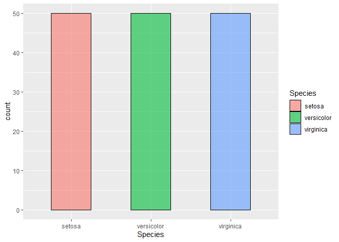
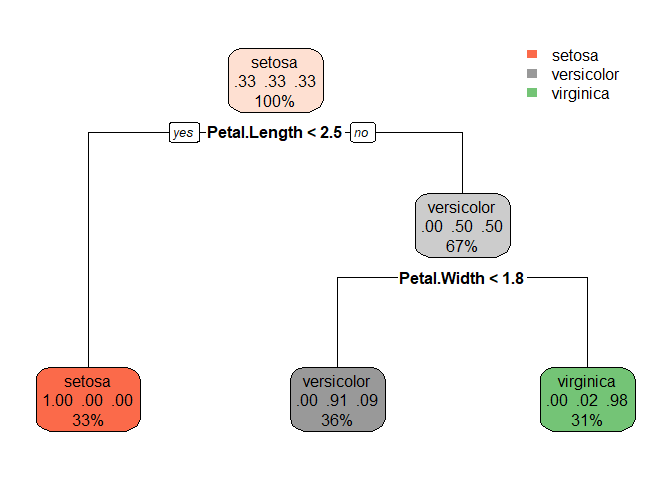

TASK 4: Decision Tree Algorithm
================

# Objective

The main Objective of this task is to give a visual representaion of how
a Decision Tree Algorithm Classifies the Dataset.

# Importing Necessary Library

We will import the necessary library for the creating a decision tree
model.

``` r
library(rpart)
```

    ## Warning: package 'rpart' was built under R version 3.6.3

``` r
library(rpart.plot)
```

    ## Warning: package 'rpart.plot' was built under R version 3.6.3

``` r
library(ggplot2)
library(tidyverse)
```

    ## Warning: package 'tidyverse' was built under R version 3.6.3

    ## -- Attaching packages ------------------- tidyverse 1.3.0 --

    ## v tibble  3.0.1     v dplyr   0.8.5
    ## v tidyr   1.0.2     v stringr 1.4.0
    ## v readr   1.3.1     v forcats 0.5.0
    ## v purrr   0.3.4

    ## Warning: package 'tibble' was built under R version 3.6.3

    ## Warning: package 'tidyr' was built under R version 3.6.3

    ## Warning: package 'readr' was built under R version 3.6.3

    ## Warning: package 'purrr' was built under R version 3.6.3

    ## Warning: package 'dplyr' was built under R version 3.6.3

    ## Warning: package 'stringr' was built under R version 3.6.3

    ## Warning: package 'forcats' was built under R version 3.6.3

    ## -- Conflicts ---------------------- tidyverse_conflicts() --
    ## x dplyr::filter() masks stats::filter()
    ## x dplyr::lag()    masks stats::lag()

# Importing Data

As we all know that “iris” dataset is a famous dataset and it is
available in almost in all Machine language. We will have a look into
the dataset.

``` r
head(iris)
```

    ##   Sepal.Length Sepal.Width Petal.Length Petal.Width Species
    ## 1          5.1         3.5          1.4         0.2  setosa
    ## 2          4.9         3.0          1.4         0.2  setosa
    ## 3          4.7         3.2          1.3         0.2  setosa
    ## 4          4.6         3.1          1.5         0.2  setosa
    ## 5          5.0         3.6          1.4         0.2  setosa
    ## 6          5.4         3.9          1.7         0.4  setosa

  - We will see what are the variables in *iris* dataset.

<!-- end list -->

``` r
names(iris)
```

    ## [1] "Sepal.Length" "Sepal.Width"  "Petal.Length" "Petal.Width"  "Species"

  - we can see that,
      - Dependent Varaiable - Species
      - Independent Variable - Sepal.Length, Sepal.Width, Petal.Length,
        Petal.Width
  - The classification in the dependent variable

<!-- end list -->

``` r
unique(iris$Species)
```

    ## [1] setosa     versicolor virginica 
    ## Levels: setosa versicolor virginica

  - So there are total of three classifaication in the dependent
    variable.

<!-- end list -->

``` r
iris %>%
  ggplot(aes(Species)) +
  geom_bar(aes(fill = Species),alpha = 0.6,color = 'black',width = 0.5)
```

<!-- -->

  - There are total of 150 record with 50 in each category.

# Creating Decision Tree Model

``` r
tree <- rpart(Species~.,data = iris,method = 'class',cp = 0.01)
```

  - Complexity Parameter is like a learning parameter, that will be used
    to control the size of our decision tree.

  - In our case the cp value of 0.01 is selected by parameter turning.
    and finding the cp with lower error, which can be found below

<!-- end list -->

``` r
printcp(tree)
```

    ## 
    ## Classification tree:
    ## rpart(formula = Species ~ ., data = iris, method = "class", cp = 0.01)
    ## 
    ## Variables actually used in tree construction:
    ## [1] Petal.Length Petal.Width 
    ## 
    ## Root node error: 100/150 = 0.66667
    ## 
    ## n= 150 
    ## 
    ##     CP nsplit rel error xerror     xstd
    ## 1 0.50      0      1.00   1.10 0.054160
    ## 2 0.44      1      0.50   0.59 0.059828
    ## 3 0.01      2      0.06   0.07 0.025833

  - We can see that for a cp of 0.01 the error is minimum of 0.09.

# Visual Split of Decision Tree.

``` r
rpart.plot(tree)
```

<!-- -->
